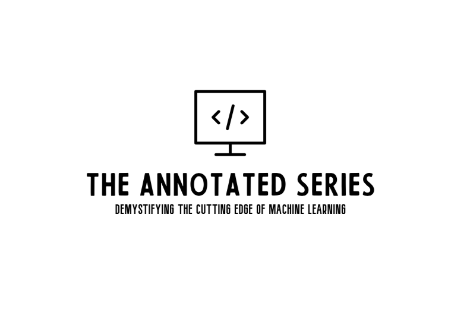

--------------

A curated collection of influential machine learning research papers, this repository takes complex, state-of-the-art methods and distills them into fully annotated, from-scratch code. Each Vault 🔐 embarks on a journey into an architecture, demystifying its inner workings 🧩, tracing pathways 🔍, and uncovering the hidden mechanics that bring each model to life. Driven by curiosity and a spirit of exploration, this series isn’t just about the “what”—it’s a call to delve into the “why” and “how” at the very core of machine learning. 🧠
