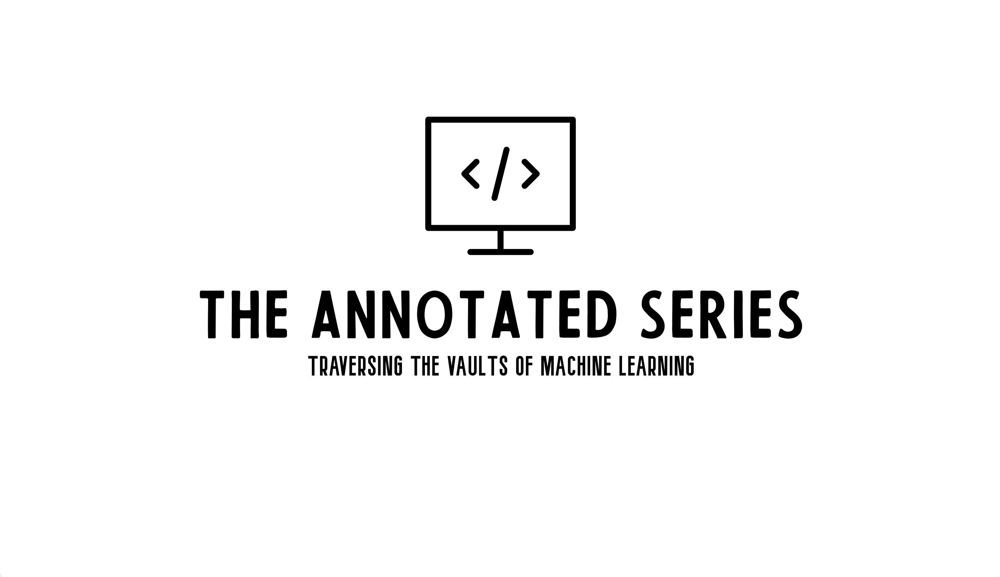

--------------

A curated collection of influential machine learning research papers, this repository takes complex, state-of-the-art methods and distills them into fully annotated, from-scratch code. Each Vault 🔐 opens into a labyrinth of discovery, with hidden pathways to trace 🔍, intricate mechanisms to decode 🧩, and sparks that breathe life into each model’s core 🔥. Fueled by curiosity and a spirit of exploration, this series isn’t just about the “what”—it’s an invitation to journey into the “why” and “how” of machine learning’s most guarded mysteries. 🧠

    

